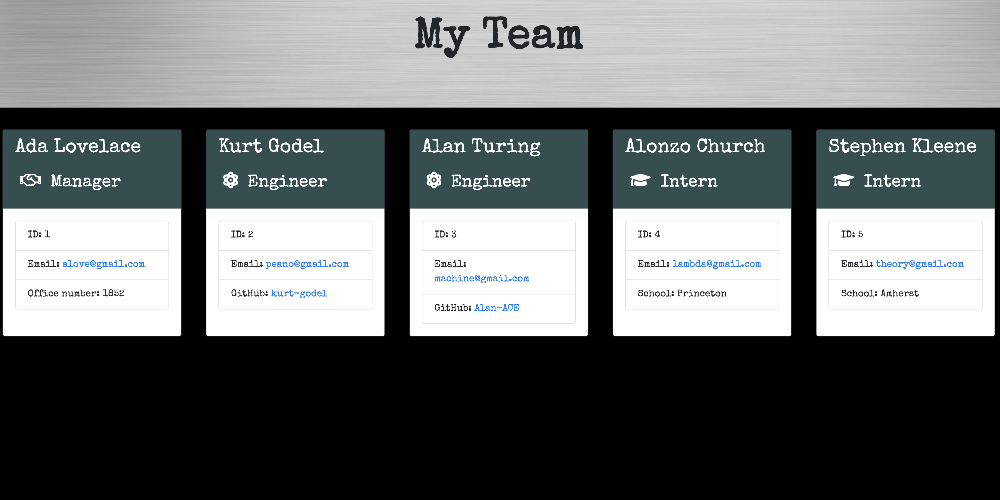

# team-generator

## Description
  A Node CLI application that creates a formatted webpage of ID cards displaying info about each member of your Engineering Team.  The cards are generated after prompts from user input are answered. They define a clear employee roster with a summary of info.  This way a manager can have quick access to employee emails and git-hub profiles for immediate contact.  

  The App was created with ES6 classes that passed all unit-testing.  The project utilizes the dependencies [jest](https://jestjs.io/) for running the provided tests, and [inquirer](https://www.npmjs.com/package/inquirer) for collecting input from the user.  

[Link to Repo](https://github.com/erin-smith/team-generator)
  

## Table of Contents
* [Installation](#Installation)
* [Usage](#Usage)
* [License](#License)
* [Contributing](#Contributing)
* [Tests](#Tests)
* [Questions](#Questions)
 
 
## Installation 
  This project uses [node](https://nodejs.org/en/) and [npm](https://www.npmjs.com/). To use this project you can clone the repository, open the file in VScode and open the terminal.  Make sure that you have node.js locally installed.   

Installation code:  

     To install, run the following command:
  `$ npm install`  

     To install necessary dependencies, run the following command(s):  
`$ npm install inquirer`

`$ npm install jest`

## Usage 
  This Node CLI app can be used to quickly generate a neatly formatted webpage of ID cards containing employee summaries of the personnel that outfit your software team. The app generates a HTML and CSS file that will be overwritten with each use for convenience.  

  After installation, you can open the app.js file in the terminal and invoke with the following command: `$ node app.js` then follow the prompts.

  You can also watch my video which is linked here:
  
  

## License 

  This project is licensed under the ISC license. 

## Contributing   
 If you would like to contribute to this project or have feedback, please contact me below in the Questions Section.
***
 **Contributors:** erin-smith   
***

 

## Tests 
  This app went through much unit-testing and you can run further tests, as I did, with the command:

   `$ npm run test` 
 
  The dependency 'jest' needs to be installed as mentioned above.  I also ran this app through dozens of iterations, console.logs, validators, and nodemon.

## Questions:  
  

  If you have any questions about the repo, [open an issue](https://github.com/erin-smith/team-generator/issues/new) or contact me:  

* [My GitHub Profile](http://github.com/erin-smith)
* 
***
